# Active Portfolio Mobile

## Goal
Active Portfolio is a Kotlin (Android) mobile app that provides computer science students with a centralized place to showcase their school and personal projects.Its purpose is to make it easy to share work, browse peers’ projects, and exchange feedback.

## Quick-start
How to install and launch your application.

### Build & Run from source
1. Clone the repository:
   ```bash
   git clone https://github.com/Linyue-dev/active-portfolio-mobile.git
   cd active-portfolio-mobile
   ```
2. Open the project in **Android Studio**.  
3. Connect an emulator or Android device.  
4. Click **Run ▶️** to launch the app.  

### ⚠️ First-time setup or long time since last run?

If you haven't opened the project in over a month, or if you encounter "Unresolved reference" errors:
```bash
# Run this before opening Android Studio
./gradlew clean
./gradlew build --refresh-dependencies
```

Then in Android Studio:
```
File → Invalidate Caches → Invalidate and Restart
```

---

## Development Environment

### Tested Configuration (Updated: 2026-01-22)
- **Android Studio**: Narwhal 2025.1.3 or later
- **JDK**: 17
- **Gradle**: 8.x (managed by wrapper)
- **Min SDK**: 24
- **Target SDK**: 36
- **Kotlin**: 2.2.21
- **Compose**: BOM 2024.09.00

### Important Notes for Developers

#### 🚫 Do NOT update Gradle/AGP/Kotlin versions during active development
If Android Studio prompts you to update:
- Click **"Remind me later"** or **"Don't ask again"**
- Only update during project downtime (semester breaks)
- Always test updates on a separate branch first

#### 🔧 Common Issues

**Problem**: `Unresolved reference 'okhttp3'`, `'retrofit2'`, etc.
**Solution**: Gradle cache issue. Run:
```bash
./gradlew clean
./gradlew build --refresh-dependencies
```
Then restart Android Studio and sync.

**Problem**: "AGP upgrade recommended" popup
**Solution**: Click **"Don't ask again"**. Do not upgrade unless necessary.

**Problem**: Build fails on teammate's machine
**Solution**:
1. Verify JDK 17 is installed
2. Pull latest code: `git pull`
3. Run the clean/refresh commands above

---

## Screenshots of application
  
**The landing page:**
  
  - 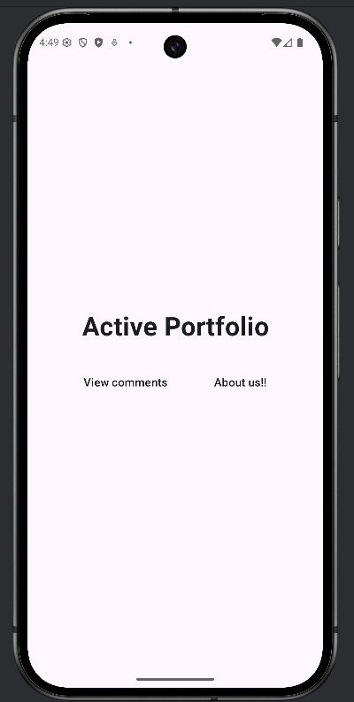
    
**The About us page:**
  - 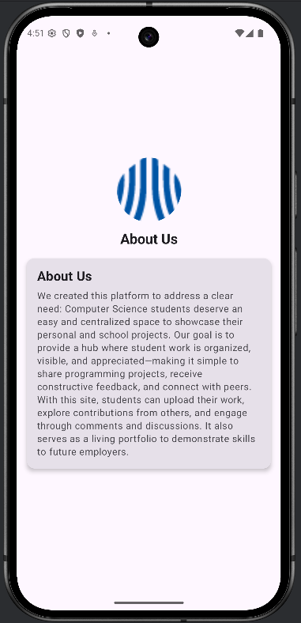
    
[//]: # (**The Comment page:**)


[//]: # ()
[//]: # (  - ![img_2.png]&#40;img_2.png&#41;)

**Adventure View page:**
 - 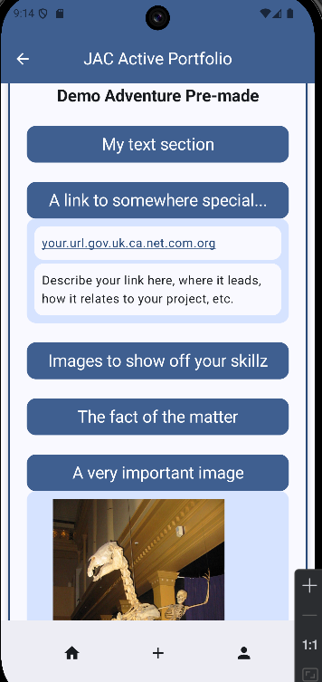

**Adventure Creation and Update page:**
 - 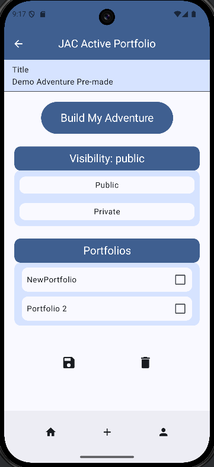

**Adventure Create Section page**
 - 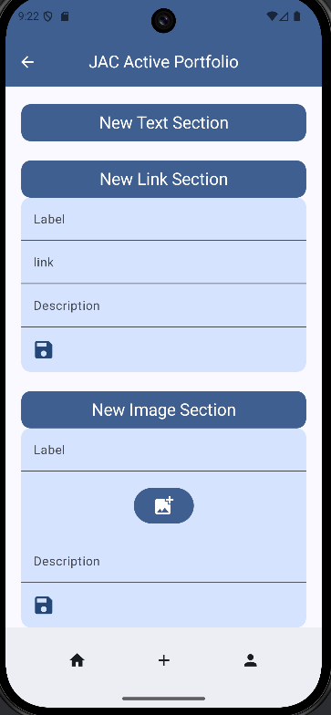

**Adventure Sections Update page:**
 - 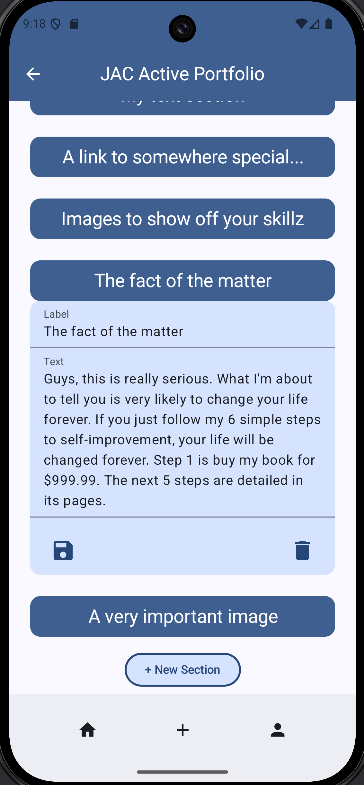
 - 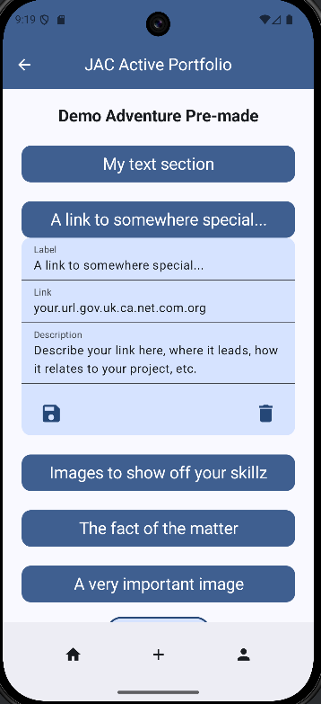
 - 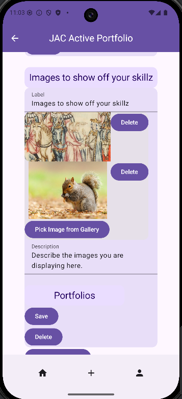

**Sign Up page:**
 - 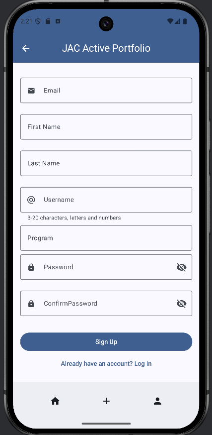

**Login page:**
 - 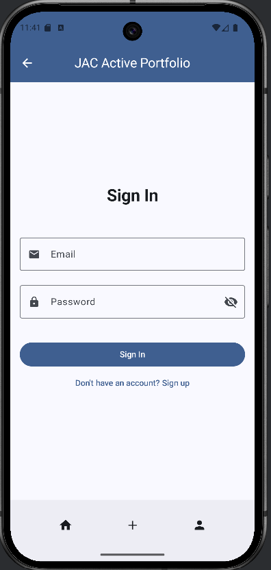

**Profile page:**
 - 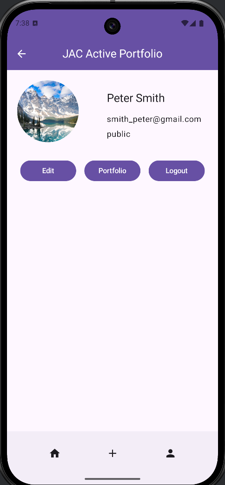

**Profile Edit page:**
 - 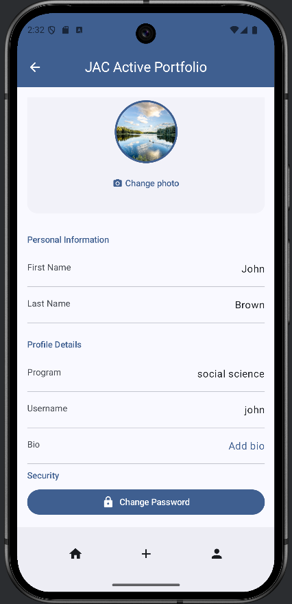

**Other User Profile page:**
 - 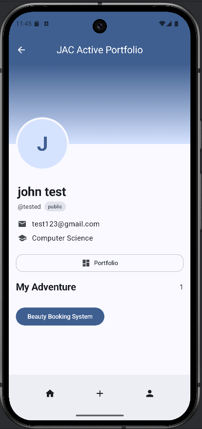

**Search Result page:**
- 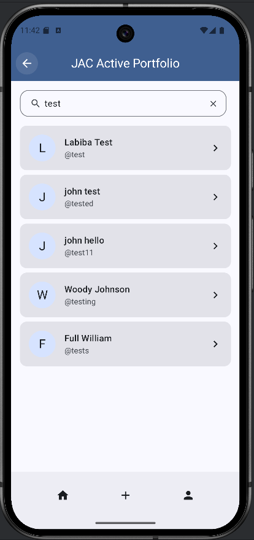

**User Portfolio page:**
- 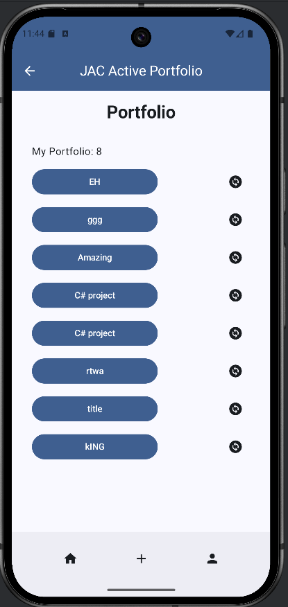

**Portfolio Creation page:**
 - 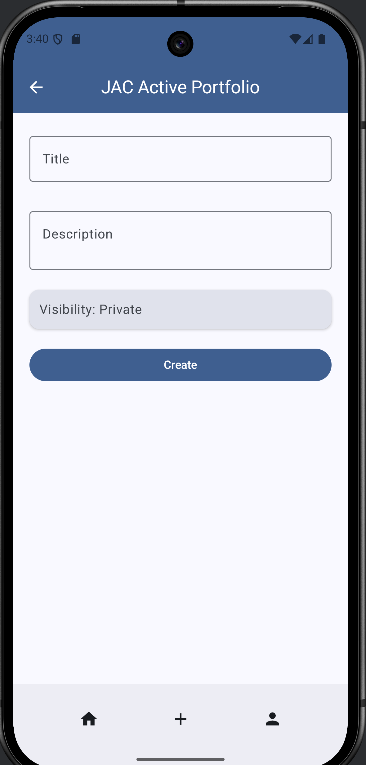
 - 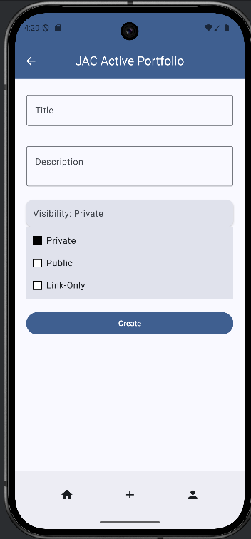

**Portfolio Update page:**
 - 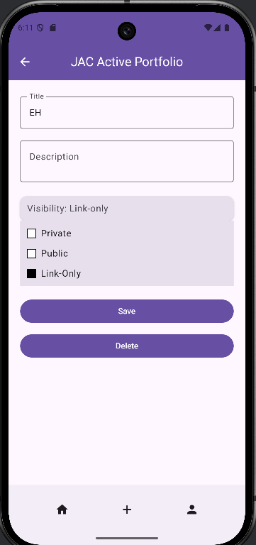

**Portfolio Display page:**
- 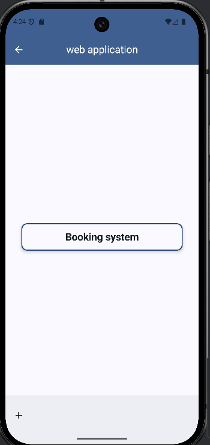
- 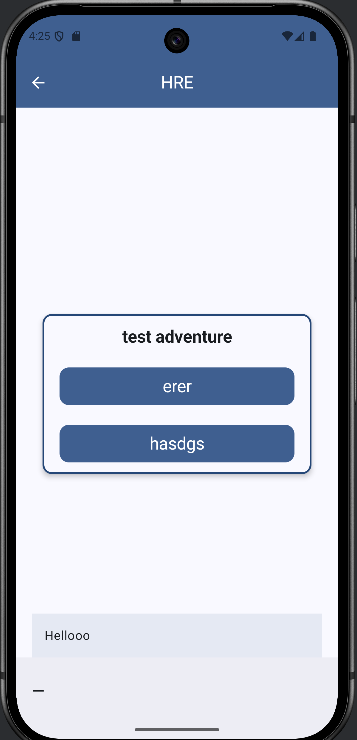

[//]: # ()
[//]: # (  - ![img_2.png]&#40;img_2.png&#41;)

## Team members
- Adam Laurin  
- Labiba Ali  
- Linyue Wang
