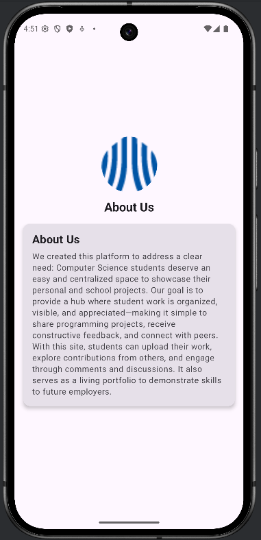

# Active Portfolio Mobile

## Goal
Active Portfolio is a Kotlin (Android) mobile app that provides computer science students with a centralized place to showcase their school and personal projects.Its purpose is to make it easy to share work, browse peers’ projects, and exchange feedback.

## Quick-start
How to install and launch your application.

### Build & Run from source (by Sprint 1)
1. Clone the repository:
   ```bash
   git clone https://github.com/Linyue-dev/active-portfolio-mobile.git
   cd active-portfolio-mobile
   ```
2. Open the project in **Android Studio**.  
3. Connect an emulator or Android device.  
4. Click **Run ▶️** to launch the app.  

⚙️ (By Sprint 1: update this section with full build requirements, e.g., SDK version, Gradle version, dependencies.)

## Screenshots of application
  
**The landing page:**
  
  - 
    
**The About us page:**
  - 
    
[//]: # (**The Comment page:**)


[//]: # ()
[//]: # (  - ![img_2.png]&#40;img_2.png&#41;)

**Adventure View page:**
 - 

**Adventure Creation and Update page:**
 - 

**Adventure Sections Update page:**
 - 
 - 
 - 

**Sign Up page:**
 - 

**Login page:**
 - 

**Profile page:**
 - 

**Profile Edit page:**
 - 

**Profile Edit Field page:**
 - 

**Portfolio Creation page:**
 - 

**Portfolio Creation page with visibility:**
 - 

**Portfolio Update page:**
 - 


[//]: # ()
[//]: # (  - ![img_2.png]&#40;img_2.png&#41;)

**Adventure View page:**
 - 

**Adventure Creation and Update page:**
 - 

**Adventure Sections Update page:**
 - 
 - 
 - 

## Team members
- Adam Laurin  
- Labiba Ali  
- Linyue Wang
